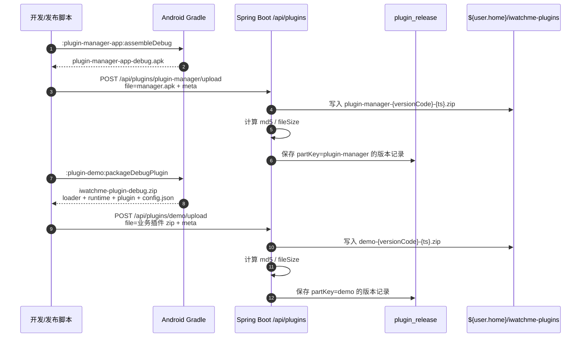
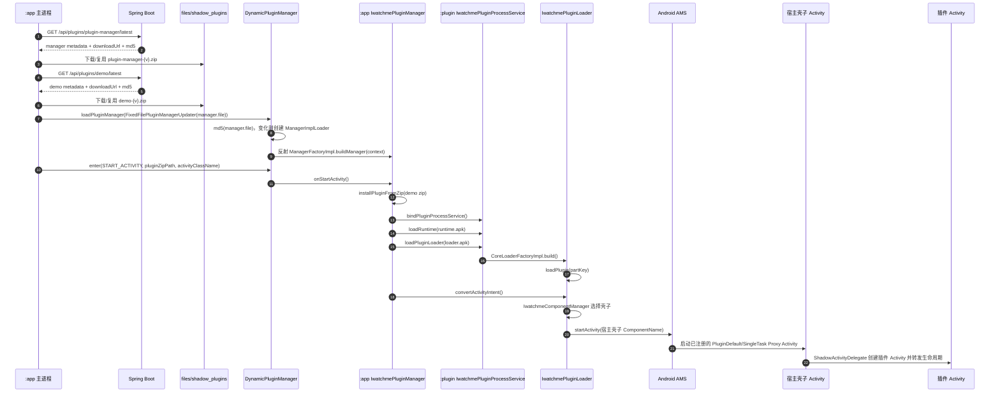

# Shadow 插件化接入手册 · 移动端

腾讯 Shadow 在 iwatchme-android 工程的完整接入说明。后端配套见 `iwatchme-springboot/docs/SHADOW_BACKEND.md`。

---

## 1. 总览

```
                              [Spring Boot 8081]
                              /api/plugins/* (查询/上传/下载/灰度)
                                       ↑
                                       │ HTTPS / Retrofit
                                       │
            ┌──────────────────────────┴──────────────────────────┐
            │                  iwatchme-android :app              │
            │                       (主进程)                       │
            │  ┌───────────────────────────────────────────────┐  │
            │  │ HostShadowInitializer (init)                  │  │
            │  │  ├─ Shadow LoggerFactory.setILoggerFactory    │  │
            │  │  ├─ DynamicRuntime.recoveryRuntime（仅:plugin）│  │
            │  │  └─ PluginCrashGuard / VersionRegistry / Degrade │  │
            │  ├───────────────────────────────────────────────┤  │
            │  │ PluginUpdateService                           │  │
            │  │  ├─ Retrofit /api/plugins/{partKey}/latest    │  │
            │  │  ├─ OkHttp 流式下载 + md5 校验                 │  │
            │  │  └─ 本地缓存：files/shadow_plugins/{part}-{v}.zip│
            │  ├───────────────────────────────────────────────┤  │
            │  │ HostShadowInitializer.loadPluginManager       │  │
            │  │  → DynamicPluginManager（按 manager.apk 路径复用）│
            │  │  → manager.apk / IwatchmePluginManager       │  │
            │  │     （动态加载后运行在当前 :app 进程）         │  │
            │  └───────────────────────────────────────────────┘  │
            │                       ↓ enter(START_ACTIVITY, ...)  │
            │  ┌───────────────────────────────────────────────┐  │
            │  │ PluginDefaultProxyActivity0..3 (壳子, :plugin) │  │
            │  └───────────────────────────────────────────────┘  │
            └─────────────────────────────────────────────────────┘
                                       ↓ Shadow 反射加载
                  ┌──────────────────────────────────────────┐
                  │            :plugin 进程 (任务隔离)        │
                  │                                          │
                  │  runtime.apk → Shadow runtime container  │
                  │     ↓                                    │
                  │  loader.apk  → IwatchmePluginLoader      │
                  │     ↓ ComponentManager.onBindContainer   │
                  │     ↓ HostActivityDelegator              │
                  │  plugin-demo.apk → MemberCenterActivity  │
                  └──────────────────────────────────────────┘
```

接入分两条产物链：

- **manager.apk 单独下发**：`plugin-manager-app-debug.apk` 作为 `partKey=plugin-manager` 上传，宿主先下载它，再交给 `DynamicPluginManager` 反射加载。manager 变更后宿主无需重新发版。
- **业务插件 zip 下发**：`plugin-loader-app-debug.apk` + `plugin-runtime-app-debug.apk` + 一个或多个业务插件 APK + `config.json` 打成 zip，作为 `partKey=demo` 或其它业务 partKey 上传。

---

## 2. 工程结构

| Module | 类型 | 职责 |
| --- | --- | --- |
| `:app` | application | 宿主主程序。声明壳子 Activity / Service / Provider，在 `MainApplication.onCreate` 初始化 Shadow + 启动预下载 |
| `:host-shadow` | library | Shadow 接入层。封装 Shadow API、网络更新链路、三道生产防线、壳子 Activity 基类 |
| `:plugin-manager-app` | application | 编译产物 `plugin-manager-app-debug.apk` —— 实现 `ManagerFactoryImpl` / `IwatchmePluginManager`，被宿主进程中的 `DynamicPluginManager` 反射加载 |
| `:plugin-loader-app` | application | 编译产物 `plugin-loader-app-debug.apk` —— 实现 `CoreLoaderFactoryImpl` / `IwatchmePluginLoader` / `IwatchmeComponentManager`，定义"插件 Activity ↔ 宿主壳子"映射 |
| `:plugin-runtime-app` | application | 编译产物 `plugin-runtime-app-debug.apk` —— Shadow runtime container 容器，无业务代码 |
| `:plugin-demo` | application (含 Shadow Transform) | 业务插件示例。包含 `MemberCenterActivity`，Shadow Transform 在编译期把它改成 `ShadowActivity` 继承 |
| `vendor/Shadow` | git submodule | 腾讯 Shadow 源码（`master` 分支），由 `tools/shadow-publish.sh` 一次性发布到 `~/.m2/` |

打包产物：
- `:app:assembleDebug` → host APK，里面已经声明了 7 个壳子 Activity
- `:plugin-demo:packageDebugPlugin` → `build/iwatchme-plugin/iwatchme-plugin-debug.zip`（含 loader.apk + runtime.apk + 业务 plugin.apk + config.json）
- `:plugin-manager-app:assembleDebug` → `plugin-manager-app-debug.apk`（单独下发，不打包在 zip 里）

---

### 2.1 谁需要自己写什么

| 角色 | 必须自己写/维护 | 说明 |
| --- | --- | --- |
| 宿主平台方 | `:host-shadow` 初始化、壳子 Activity/Service/Provider、下载器、崩溃/回滚防线 | 这部分随宿主发版，应该尽量稳定、薄。新增 launchMode 壳子也在这里声明 |
| 插件平台方 | `:plugin-manager-app`、`:plugin-loader-app`、`:plugin-runtime-app` | manager 负责安装和调度；loader 负责加载插件和组件映射；runtime 基本跟 Shadow 框架绑定，通常少改 |
| 业务方 | 业务插件 module，如 `:plugin-demo` | 写普通 Android 代码，Activity 仍继承 `android.app.Activity`，由 Shadow Transform 改写 |
| 后端/发布方 | `/api/plugins/*` 版本服务和文件存储 | 同一套 upload/latest/download 接口同时承载 `plugin-manager` 和业务插件 zip |

业务方最常改的是三类代码：

1. **业务页面/服务/Provider**：例如 `MemberCenterActivity`、`PluginDemoService`、`PluginMemberProvider`。
2. **业务插件 manifest**：声明插件 Activity、Service、Provider；如果要演示 `singleTask`，插件 manifest 要声明 `android:launchMode="singleTask"`。
3. **组件映射表**：有特殊 launchMode 时，需要在 `IwatchmeComponentManager.onBindContainerActivity()` 里把插件 Activity className 映射到对应宿主壳子。普通 Activity 不需要逐个映射，默认走 `PluginDefaultProxyActivity0`。

首次把 Shadow 接进一个宿主时，平台接入方还需要实现：

| 一次性接入项 | 我们工程的实现 | 普通业务版本是否反复修改 |
| --- | --- | --- |
| manager 反射入口和调度策略 | `ManagerFactoryImpl`、`IwatchmePluginManager`、`FastPluginManager` | 通常否；仅安装/启动策略变化时改，并独立发布 manager.apk |
| loader 反射入口和组件路由 | `CoreLoaderFactoryImpl`、`IwatchmePluginLoader`、`IwatchmeComponentManager` | 普通 standard 页面否；新增特殊壳子或映射时改 |
| runtime 壳接入 | `:plugin-runtime-app` | 通常不改，跟随 Shadow 运行时能力升级 |
| 宿主容器与更新能力 | `:host-shadow`、宿主 manifest、`MainApplication` | 宿主基础设施变动才随宿主发版 |
| 发布服务 | Spring Boot `com.iwatchme.springshop.shadow` | 后端协议或存储策略变化才改 |

后续新增一个普通业务插件页面时，业务方只需要：

1. 在插件 module 里写 Activity/Service/Provider 和插件 manifest。
2. 按已有 `packageDebugPlugin` 配置生成业务 zip。
3. 提升业务 `versionCode`，以业务 `partKey` 上传新版 zip。

只有当页面要求 `singleTask` / `singleInstance` 等特殊容器行为时，才需要插件平台方同步补 `IwatchmeComponentManager` 路由，宿主里也必须提前有相应 launchMode 的壳子。

本次 singleTask demo 对应两处：

```xml
<!-- plugin-demo/src/main/AndroidManifest.xml -->
<activity
    android:name="com.iwatchme.plugin.demo.SingleTaskProbeActivity"
    android:launchMode="singleTask" />
```

```kotlin
// plugin-loader-app/.../IwatchmeComponentManager.kt
override fun onBindContainerActivity(pluginActivity: ComponentName): ComponentName {
    return when (pluginActivity.className) {
        "com.iwatchme.plugin.demo.SingleTaskProbeActivity" ->
            ComponentName(context, "com.iwatchme.host.shadow.container.PluginSingleTaskProxyActivity0")
        else ->
            ComponentName(context, "com.iwatchme.host.shadow.container.PluginDefaultProxyActivity0")
    }
}
```

---

### 2.2 发布时序：manager.apk 与业务插件 zip



后端文件名统一使用 `{partKey}-{versionCode}-{timestamp}.zip`。因此 manager 上传后磁盘上也叫 `plugin-manager-1-xxx.zip`，但文件内容就是 APK；APK 本身是 zip 容器，这不影响 Shadow 加载。

---

### 2.3 运行时序：下载、加载、启动插件 Activity



关键点：

- `DynamicPluginManager.enter()` 每次会先检查 manager 文件 md5；md5 变了才重新反射 `ManagerFactoryImpl`。
- `plugin-manager.apk` 决定“怎么安装/启动插件”，所以它可热更；它由 `DynamicPluginManager` 在调用方进程加载，本 Demo 中就是宿主主进程，不是在 `:plugin` 进程。
- `plugin-loader.apk` 决定“插件组件映射到哪个宿主壳子”，例如 singleTask demo 映射到 `PluginSingleTaskProxyActivity0`。
- `plugin-runtime.apk` 提供 Shadow 运行时容器和代理基类，业务一般不改。

---

## 3. 接入步骤（fresh clone）

### 3.1 一次性环境准备

```bash
# 1. clone 主工程
git clone <iwatchme-android>
cd iwatchme-android

# 2. 拉 Shadow submodule
git submodule update --init vendor/Shadow

# 3. 发布 Shadow SDK 到本机 Maven（自动化）
./tools/setup.sh
# setup.sh 会调 tools/shadow-publish.sh:
#  - 检测 JDK 17（Gradle 7.5 不支持 JDK 21）
#  - 把 Shadow gradle-wrapper 的 mirrors.tencent.com（已退役）改成 mirrors.cloud.tencent.com
#  - cd vendor/Shadow && ./gradlew publish
#  - 输出物：~/.m2/repository/com/tencent/shadow/{core,dynamic,plugin}/*/local/

# 4. sync + 编译验证
./gradlew :app:assembleDebug
./gradlew :plugin-demo:packageDebugPlugin
```

第 3 步需要 **5–10 分钟**首次执行（含下载 Gradle 7.5 wrapper + AGP 7.4.2 + 编译 Shadow SDK）。后续 cache 命中只要秒级。

### 3.2 依赖坐标

`gradle/libs.versions.toml`：

```toml
[versions]
tencentShadow = "local"  # Shadow publish 后固定为 'local'

[libraries]
tencent-shadow-core-common = { module = "com.tencent.shadow.core:common", version.ref = "tencentShadow" }
tencent-shadow-core-runtime = { module = "com.tencent.shadow.core:runtime", version.ref = "tencentShadow" }
tencent-shadow-core-loader = { module = "com.tencent.shadow.core:loader", version.ref = "tencentShadow" }
tencent-shadow-core-manager = { module = "com.tencent.shadow.core:manager", version.ref = "tencentShadow" }
tencent-shadow-core-activity-container = { module = "com.tencent.shadow.core:activity-container", version.ref = "tencentShadow" }
tencent-shadow-dynamic-host = { module = "com.tencent.shadow.dynamic:host", version.ref = "tencentShadow" }
tencent-shadow-dynamic-manager = { module = "com.tencent.shadow.dynamic:manager", version.ref = "tencentShadow" }
tencent-shadow-dynamic-loader = { module = "com.tencent.shadow.dynamic:loader", version.ref = "tencentShadow" }
tencent-shadow-dynamic-loader-impl = { module = "com.tencent.shadow.dynamic:loader-impl", version.ref = "tencentShadow" }

[plugins]
tencent-shadow-plugin = { id = "com.tencent.shadow.plugin", version.ref = "tencentShadow" }
```

> Maven artifactId 是 **不带 `dynamic-` 前缀** 的（`com.tencent.shadow.dynamic:host` 而非 `dynamic-host`），别照抄 Shadow sample-host/build.gradle 里写法。

`settings.gradle.kts` 顶部要加 `mavenLocal()`：

```kotlin
pluginManagement {
    repositories {
        mavenLocal()          // 解析 com.tencent.shadow.plugin
        // ... 其它镜像
    }
}
dependencyResolutionManagement {
    repositories {
        mavenLocal()          // 解析 com.tencent.shadow.* artifact
        // ... 其它镜像
    }
}
```

每个消费 Shadow 的 module **还要在自己的 build.gradle.kts 加** `repositories { mavenLocal() }`，因为 `~/.gradle/init.d/mirror.gradle` 注入的 aliyun 镜像会通过 `allprojects { repositories {} }` 覆盖 settings 配置。

### 3.3 :app 接入要点

**壳子 Activity / Service / Provider 声明都在 `:host-shadow` 的 library manifest 里**（`host-shadow/src/main/AndroidManifest.xml`），AGP 在 manifest merger 阶段自动合并进 `:app` 最终 APK manifest。:app 自己的 manifest 只声明业务 Activity，不需要知道 Shadow 内部细节。

`:host-shadow/src/main/AndroidManifest.xml` 包含 7 个壳子 Activity + 1 个 Service + 1 个 Provider，全部 `android:process=":plugin"` + `android:taskAffinity=":plugin.task"` + `android:excludeFromRecents="true"`：

```xml
<!-- 4 个 standard 壳子 -->
<activity android:name="com.iwatchme.host.shadow.container.PluginDefaultProxyActivity0"
    android:exported="false"
    android:launchMode="standard"
    android:configChanges="mcc|mnc|locale|touchscreen|keyboard|keyboardHidden|navigation|screenLayout|fontScale|uiMode|orientation|screenSize|smallestScreenSize|layoutDirection"
    android:hardwareAccelerated="true"
    android:multiprocess="true"
    android:process=":plugin"
    android:taskAffinity=":plugin.task"
    android:excludeFromRecents="true"
    android:theme="@android:style/Theme.Translucent.NoTitleBar.Fullscreen" />
<!-- ... PluginDefaultProxyActivity1/2/3 -->

<!-- 2 个 singleTask + 1 个 singleInstance 同理 -->

<!-- 跨进程 PPS -->
<service android:name="com.iwatchme.host.shadow.IwatchmePluginProcessService"
    android:exported="false"
    android:process=":plugin" />

<!-- Shadow ContentProvider 容器 -->
<provider android:name="com.tencent.shadow.core.runtime.container.PluginContainerContentProvider"
    android:authorities="${applicationId}.shadow.provider.dynamic"
    android:exported="false"
    android:grantUriPermissions="true"
    android:process=":plugin" />
```

**`MainApplication.onCreate`**：

```kotlin
JetpackStartupManager.start(this)
PlayerSdk.init(this)
HostShadowInitializer.init(this)

if (HostShadowInitializer.isMainProcess) {
    // 挂到项目 JetpackStartupManager 的 idle 阶段：
    // MainActivity.reportFullyDrawn() → markFullyDrawnReported() → MessageQueue idle → hook 执行
    JetpackStartupManager.registerExternalIdleHook("shadow-preload") { app ->
        PluginPreloader(app, service, listOf("plugin-manager", "demo"), deviceId).preloadAll()
    }
}
```

> 不再自己起 `appScope` + `addIdleHandler`——直接复用 `:startupLab` 的 idle drain 调度器，
> 跟其它 idle 任务（如 catalog 里 `idle_preload`）共享统计与可观测性（耗时会出现在 Startup Inspector 的 dashboard 笔记里）。

### 3.4 业务插件（`:plugin-demo`）写法

```kotlin
// plugin-demo/build.gradle.kts —— 插件顺序敏感
plugins {
    alias(libs.plugins.android.application)
    alias(libs.plugins.tencent.shadow.plugin)   // 必须在 kotlin-android 之前
    alias(libs.plugins.kotlin.android)
}

android {
    defaultConfig {
        applicationId = "com.iwatchme.android"  // 必须与 host 一致
    }
    aaptOptions {
        additionalParameters("--package-id", "0x7e", "--allow-reserved-package-id")
    }
}

configure<PackagePluginExtension> {
    archivePrefix = "iwatchme-plugin"
    destinationDir = "${rootProject.buildDir}/iwatchme-plugin"
    loaderApkProjectPath = "plugin-loader-app"
    runtimeApkProjectPath = "plugin-runtime-app"
    buildTypes.create("debug").apply {
        loaderApkConfig = Tuple2("plugin-loader-app-debug.apk", ":plugin-loader-app:assembleDebug")
        runtimeApkConfig = Tuple2("plugin-runtime-app-debug.apk", ":plugin-runtime-app:assembleDebug")
        pluginApks.create("memberCenter").apply {
            partKey = "iwatchme-plugin-main"
            buildTask = ":plugin-demo:assemblePluginDebug"
            apkPath = "plugin-demo/build/outputs/apk/plugin/debug/plugin-demo-plugin-debug.apk"
        }
    }
}

dependencies {
    compileOnly(libs.tencent.shadow.core.runtime)  // 由 host 提供，不打包到 plugin
}
```

业务 Activity **直接继承 `android.app.Activity`**：

```kotlin
// plugin-demo/.../MemberCenterActivity.kt
class MemberCenterActivity : Activity() {     // 编译期被 Shadow Transform 改成 PluginActivity
    override fun onCreate(savedInstanceState: Bundle?) {
        super.onCreate(savedInstanceState)
        // 业务代码
    }
}
```

打包：`./gradlew :plugin-demo:packageDebugPlugin` → `build/iwatchme-plugin/iwatchme-plugin-debug.zip`。

---

## 4. 关键代码索引

| 文件 | 作用 |
| --- | --- |
| `host-shadow/.../HostShadowInitializer.kt` | Application 初始化入口；`init()` 双进程兼容，`loadPluginManager()` 按 manager.apk 路径缓存复用 |
| `host-shadow/.../PluginUpdateService.kt` | 检查更新 → 下载 → md5 校验 → 返回本地 zip |
| `host-shadow/.../PluginUpdateApi.kt` | Retrofit 接口，定义 `/latest` / `/versions` |
| `host-shadow/.../PluginDownloader.kt` | OkHttp 流式下载 + md5 实时计算 |
| `host-shadow/.../PluginPreloader.kt` | App 启动 `IdleHandler` 触发的后台预下载 |
| `host-shadow/.../IwatchmePluginProcessService.kt` | 跑在 :plugin 进程的 Shadow PluginProcessService |
| `host-shadow/.../AndroidLogLoggerFactory.kt` | 桥接 Shadow Logger → Logcat（**禁止用 runCatching**，否则 :plugin 进程秒崩） |
| `host-shadow/.../container/PluginDefaultProxyActivity.kt` 等 7 个 | 壳子 Activity，继承 `PluginContainerActivity`，`delegateProviderKey = "iwatchme-plugin-default"` |
| `host-shadow/.../safety/PluginCrashGuard.kt` | 滑动窗口崩溃计数 |
| `host-shadow/.../safety/PluginVersionRegistry.kt` | SharedPreferences 持久化"当前/稳定"版本号，用于回滚 |
| `host-shadow/.../safety/PluginDegradeManager.kt` | 服务端强降级 / 本地连续崩溃降级决策 |
| `plugin-manager-app/.../tencent/shadow/dynamic/impl/ManagerFactoryImpl.java` | **固定包名+类名**，被 Shadow 反射调用 |
| `plugin-manager-app/.../tencent/shadow/dynamic/impl/WhiteList.java` | **固定包名+类名**，列出宿主允许插件反向访问的类前缀 |
| `plugin-manager-app/.../iwatchme/plugin/manager/IwatchmePluginManager.kt` | 业务 Manager，处理 START_ACTIVITY 等指令 |
| `plugin-manager-app/.../iwatchme/plugin/manager/FastPluginManager.kt` | 安装 + odex + 抽 SO 的并发实现，仿 sample-manager |
| `plugin-loader-app/.../tencent/shadow/dynamic/loader/impl/CoreLoaderFactoryImpl.java` | **固定包名+类名** |
| `plugin-loader-app/.../iwatchme/plugin/loader/IwatchmePluginLoader.kt` | `delegateProviderKey = "iwatchme-plugin-default"` 必须与壳子 Activity 一致 |
| `plugin-loader-app/.../iwatchme/plugin/loader/IwatchmeComponentManager.kt` | 插件 Activity ↔ 宿主壳子 Activity 映射表 |

---

## 5. 进程模型 / 崩溃隔离

```
进程视图：
┌───────────────────────┐                     ┌───────────────────────┐
│ com.iwatchme.android  │ ←── Binder IPC ──→  │  com.iwatchme.android:plugin │
│  task 25              │                     │  task 26 (独立 affinity)     │
│  ├─ MainActivity      │                     │  ├─ PluginDefaultProxyActivity0│
│  └─ DemoScreen        │                     │  ├─ MemberCenterActivity (插件)│
│  DynamicPluginManager │                     │  └─ IwatchmePluginProcessService│
│  + manager.apk Impl   │                     │     loader/runtime/plugin APK  │
└───────────────────────┘                     └───────────────────────┘
```

**崩溃隔离三层**：

1. **进程隔离** —— 壳子 Activity / IwatchmePluginProcessService 都 `android:process=":plugin"`，插件代码崩只杀 :plugin 进程
2. **Task 隔离** —— 壳子 Activity 加 `android:taskAffinity=":plugin.task"`，避免 ActivityManager 的 `finishTopCrash` 把宿主 MainActivity task 一起清掉（用户能从插件崩溃自动回到 demo 屏，不跳桌面）
3. **应用层防线** —— `SafePluginActivity` 包裹生命周期 try/catch；`PluginCrashGuard` 滑动窗口计数；`PluginVersionRegistry` 触发阈值时自动切回上个稳定版本；`PluginDegradeManager` 决策强降级到 H5

---

## 6. 性能优化

| 优化 | 实现 | 节省 |
| --- | --- | --- |
| **预下载挂到 JetpackStartupManager idle hook** | `MainApplication.onCreate` 主进程分支调 `JetpackStartupManager.registerExternalIdleHook("shadow-preload") { ... PluginPreloader.preloadAll() }`，在首屏 `reportFullyDrawn()` 触发的 MessageQueue idle 后跑（跟项目启动框架对齐，可在 Startup Inspector 看到耗时） | **首次冷启 7–8s → ~1.5s** |
| **PluginManager 复用** | `HostShadowInitializer.loadPluginManager` 按 manager.apk 路径缓存复用 `DynamicPluginManager` 实例，省一次 `md5File()` + `ManagerFactoryImpl.newInstance()` | **重复加载 ③ 阶段 100ms+ → 1ms**（manager.apk 大时收益明显） |
| **Shadow 内置 md5 复用** | `DynamicPluginManager.updateManagerImpl` 内部已经做 `TextUtils.equals(mCurrentImplMd5, md5)` 跳过 ManagerImpl 重建 | 来自 Shadow，自动生效 |
| **下载缓存** | `PluginUpdateService` 按 `${partKey}-${versionCode}.zip` 文件名缓存；只要 versionCode 不变，重复 `checkAndDownload` 直接 `fromCache=true` 返回 | 省网络下载 800ms–几秒 |
| **跨进程 Service 复用** | 仅插件 Activity 崩、:plugin 进程未死时，`bindService` 拿到老 binder，`waitServiceConnected` 0ms 返回 | 重复加载 ~500ms → 0ms |

实测耗时：

| 场景 | 端到端（点击 → 插件 Activity 显示） |
| --- | --- |
| 同次 app 内 :plugin 进程未死 + 全部 cache 命中 | **~135ms** ⚡️ |
| App 重启后第一次（preload 已完成）→ 进 demo → 点一键 | **~1.5s** |
| 首次冷启（没 preload，纯 fresh） | 5–10s（下载 + 全套 install）|

剩余 ~1.5s 主要花在 Shadow `installPluginFromZip`（解压 + odex）+ 起 `:plugin` 进程 + 反射加载 manager/loader/runtime —— 想再压只能改 Shadow 源码加"已 install 跳过"逻辑。

---

## 7. 后端契约 + 升级流程

### 7.1 与后端协议

依赖 4 个 Retrofit 接口（详见 `iwatchme-springboot/docs/SHADOW_BACKEND.md`）：

```kotlin
@GET("api/plugins/{partKey}/latest")
suspend fun latest(@Path("partKey") partKey: String,
                   @Query("deviceId") deviceId: String): PluginReleaseDto

@GET("api/plugins/{partKey}/versions")
suspend fun versions(@Path("partKey") partKey: String): List<PluginReleaseDto>
```

`PluginReleaseDto` 字段：`id / partKey / versionName / versionCode / fileSize / md5 / rolloutPercent / rolledBack / downloadUrl / createdAt`。

灰度由后端按 `deviceId.hashCode() % 100 < rolloutPercent` 判定，**客户端不需要任何额外逻辑**。

### 7.2 发布一个新版插件

```bash
# 1. 改业务代码（如 MemberCenterActivity 文案）+ 把 plugin-demo/build.gradle.kts 的 versionCode 加 1

# 2. 重打包
./gradlew :plugin-demo:packageDebugPlugin

# 3. 上传到后端
curl -X POST \
  -H "X-Admin-Token: dev-change-me" \
  -F "file=@build/iwatchme-plugin/iwatchme-plugin-debug.zip" \
  -F 'meta={"versionName":"2.0.0","versionCode":2,"rolloutPercent":100,"releaseNotes":"..."}' \
  http://localhost:8081/api/plugins/demo/upload

# 4. 模拟器上同一个 app（不需重装）再点「一键」
#    PluginUpdateService 调 /latest 拿到 v2 → 缓存 miss → 下载 → 显示新文案
```

### 7.3 发布 manager.apk

manager 不在 `iwatchme-plugin-debug.zip` 里。它是独立 APK，走同一个后端上传接口，只是 `partKey=plugin-manager`：

```bash
# 1. 打 manager APK
./gradlew :plugin-manager-app:assembleDebug

# 2. 上传到后端。versionCode 不能与已有 plugin-manager 版本重复
curl -X POST \
  -H "X-Admin-Token: dev-change-me" \
  -F "file=@plugin-manager-app/build/outputs/apk/debug/plugin-manager-app-debug.apk" \
  -F 'meta={"versionName":"1.0.0","versionCode":1,"rolloutPercent":100,"releaseNotes":"shadow manager apk"}' \
  http://localhost:8081/api/plugins/plugin-manager/upload

# 3. 验证后端当前下发版本
curl -sS "http://localhost:8081/api/plugins/plugin-manager/latest?deviceId=test-1"
```

后端不会区分“这是 apk 还是 zip”，只按二进制文件保存。当前实现统一命名为：

```text
${user.home}/iwatchme-plugins/{partKey}-{versionCode}-{timestamp}.zip
```

所以 manager 在开发机上会类似：

```text
/Users/iwatchme/iwatchme-plugins/plugin-manager-1-1779459820979.zip
```

这个文件名后缀是 `.zip`，内容仍是 `plugin-manager-app-debug.apk`。客户端下载后还会再放一份到宿主私有目录：

```text
/data/user/0/com.iwatchme.android/files/shadow_plugins/plugin-manager-1.zip
```

Demo 里对应代码：

```kotlin
val manager = service.checkAndDownload("plugin-manager", deviceId).getOrThrow()
val pluginManager = HostShadowInitializer.loadPluginManager(
    FixedFilePluginManagerUpdater(manager.file)
)
```

`DynamicPluginManager` 使用这个本地 manager 文件；md5 变化时才重建 `ManagerImplLoader` 并反射新的 `ManagerFactoryImpl`。

### 7.4 灰度发布

```bash
# 先小流量
curl ... -F 'meta={"versionCode":2,"rolloutPercent":10}' .../demo/upload

# 观察后调大
curl -X PATCH -H "X-Admin-Token: ..." \
  -d '{"rolloutPercent":50}' \
  http://localhost:8081/api/plugins/releases/{id}/rollout

# 出问题立即回滚
curl -X PATCH -H "X-Admin-Token: ..." \
  -d '{"rolledBack":true}' \
  http://localhost:8081/api/plugins/releases/{id}/rollout
# 客户端下次 /latest 返回上一稳定版
```

---

## 8. 已知坑（按重要度）

### 8.1 Shadow 框架级（绕不开）

- **Shadow 没有发布到 Maven Central**：只能 `git submodule` + `./gradlew publish` 到 mavenLocal。固化在 `tools/shadow-publish.sh`
- **Shadow 内部 build_gradle_version = 7.4.2，要 JDK 17**：与本工程 AGP 8.12.0 / JDK 21 不兼容；publish 步骤独立用 JDK 17 跑，跟本工程 Gradle daemon 隔离
- **Shadow 自带 gradle-wrapper 指向 mirrors.tencent.com（已退役）**：脚本会自动改成 `mirrors.cloud.tencent.com`，submodule 因此多一行 dirty 是预期行为
- **Maven artifactId 不带 `dynamic-` 前缀**：sample-host/build.gradle 里写的 `com.tencent.shadow.dynamic:dynamic-host` 是错的，实际 artifactId 是 `host`
- **Shadow runtime 强制依赖 Android 13 API**：`GeneratedHostActivityDelegator` 引用 `android.window.OnBackInvokedDispatcher`，**API < 33 设备类加载阶段 LinkageError**。真机验证必须 API 33+
- **Shadow Transform 插件顺序敏感**：`com.android.application` → `com.tencent.shadow.plugin` → `kotlin-android`，`:plugin-demo` 不能走带 kotlin-android 的 convention plugin

### 8.2 :plugin 进程 + Kotlin 兼容（容易踩）

- **`runCatching` / 高阶函数在 :plugin 进程会触发 `IllegalAccessError`**：Kotlin 编译这些会生成 `kotlin.jvm.internal.CallableReference`，其 `<clinit>` 在 API 37+ 多 dex + :plugin 进程隔离下抛错，让整个 :plugin 进程秒崩，次生导致 host 端 `bindService` 永远 10s 超时
  - **`host-shadow` 里所有可能被 :plugin 进程加载的 Kotlin 代码必须用 plain `try/catch`**
  - 受影响文件：`HostShadowInitializer`、`AndroidLogLoggerFactory`
- **Shadow LoggerFactory 是全局静态**：主进程 AND :plugin 进程都要调 `setILoggerFactory`，否则 `:plugin` 进程的 `DynamicRuntime.<clinit>` 抛 `RuntimeException("没有找到 ILoggerFactory 实现")`
- **`MainApplication.onCreate` 在两个进程都跑**：所有"主进程独有"代码（如 PluginPreloader）必须放在 `HostShadowInitializer.isMainProcess` 判断后面

### 8.3 用户体验层（已修复）

- **壳子 Activity 必须设独立 `taskAffinity`**：否则插件崩溃 `finishTopCrash` 清掉整个 task 含宿主 MainActivity，用户跳桌面看到"keeps stopping"对话框。所有 `PluginXxxProxyActivity*` 加 `android:taskAffinity=":plugin.task" android:excludeFromRecents="true"`
- **`DynamicPluginManager` 构造时 `getLatest()` 必须返回非空文件**，否则抛 IllegalArgumentException。必须先下载 manager.apk 再 `loadPluginManager()`
- **`OkHttpClient` 通过默认参数泄露给消费者**：`PluginUpdateClient.create(baseUrl)` 的可选 `OkHttpClient` 参数被 Kotlin 编译期解析需要 OkHttp 在 :app 的 classpath 上。`host-shadow/build.gradle.kts` 用 `api(libs.okhttp)` 而非 `implementation`

### 8.4 工程链路（已规避）

- **`~/.gradle/init.d/mirror.gradle` 通过 `allprojects { repositories {} }` 覆盖 dependencyResolutionManagement**：每个消费 Shadow 的 module 必须在自己的 build.gradle.kts 加 `repositories { mavenLocal() }`，否则 Shadow artifact 解析失败

---

## 9. 验证清单（任意修改后跑一遍）

```bash
# 1. 编译
./gradlew :host-shadow:assembleDebug \
          :plugin-manager-app:assembleDebug \
          :plugin-loader-app:assembleDebug \
          :plugin-runtime-app:assembleDebug \
          :plugin-demo:packageDebugPlugin \
          :app:assembleDebug

# 2. 后端起来 + 上传 zip
cd ../iwatchme-springboot && ./mvnw spring-boot:run &
curl -X POST -H "X-Admin-Token: dev-change-me" \
  -F "file=@build/iwatchme-plugin/iwatchme-plugin-debug.zip" \
  -F 'meta={"versionName":"1.0.0","versionCode":1,"rolloutPercent":100}' \
  http://localhost:8081/api/plugins/demo/upload
curl -X POST -H "X-Admin-Token: dev-change-me" \
  -F "file=@plugin-manager-app/build/outputs/apk/debug/plugin-manager-app-debug.apk" \
  -F 'meta={"versionName":"1.0.0","versionCode":1,"rolloutPercent":100}' \
  http://localhost:8081/api/plugins/plugin-manager/upload

# 3. 模拟器（API 33+）装宿主
./gradlew :app:installDebug

# 4. 启动 + 进 demo → 点「一键」
adb shell am start -n com.iwatchme.android/.MainActivity
# 期待：屏幕显示 MemberCenterActivity 业务页面

# 5. singleTask demo 验证
# 插件页面点「⑤ 打开 singleTask 插件 Activity」：
# - logcat 应看到 PluginSingleTaskProxyActivity0 + LAUNCH_SINGLE_TASK
# - 页面首次显示 event=onCreate / onCreate count=1 / onNewIntent count=0
# 再点「再次启动自己，验证 onNewIntent」：
# - instanceId 不变
# - onCreate count 仍为 1
# - onNewIntent count 变为 1
```

闭环最低门槛是 **MemberCenterActivity 在屏幕上能渲染**，崩溃测试只是加分。
